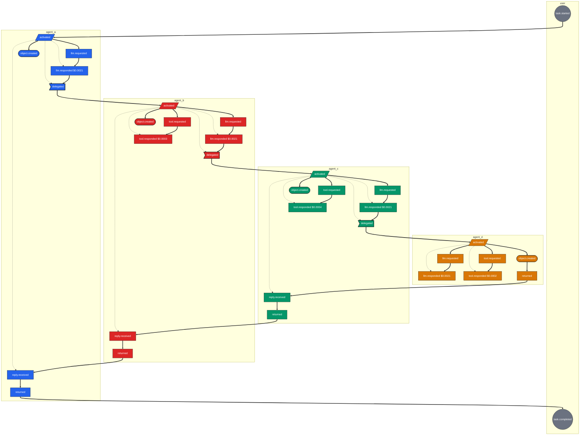

# Multi-Agent Causal Tracing — Trial

A four-agent delegation workflow instrumented with **OpenTelemetry**, an **append-only causal event store**, and a **causal graph projection**, built to demonstrate that causation across autonomous agents can be distinguished from mere temporal correlation.

The trial asks: *can we determine not only that multiple events happened near each other in time, but that one agent action actually caused or delegated the next?* This implementation answers yes — and shows how.

---

## What it does

A user triggers a task; one orchestrator agent reasons about it, produces an intermediate claim, and delegates execution to three worker agents in sequence. Each worker runs an LLM call, invokes a tool, produces an object with declared provenance, and hands off (except the last, which replies upward).

```
user
 │  task.started
 ▼
agent_a  (orchestrator)        ── llm ──> object ──> delegated
                                                     │
                                                     ▼
agent_b  (worker)              ── llm ──> tool ──> object ──> delegated
                                                                │
                                                                ▼
agent_c  (worker)              ── llm ──> tool ──> object ──> delegated
                                                                │
                                                                ▼
agent_d  (worker)              ── llm ──> tool ──> object
 │  returned ↑ through c → b → a
 ▼
user
 │  task.completed
```

**Three tiers, three responsibilities:**

| Tier | Actor | Role | Owns |
|---|---|---|---|
| Boundary | `user` | operator | `task.started`, `task.completed`, `task.failed` |
| Coordination | `agent_a` | orchestrator | plans, produces claim, delegates to workers |
| Execution | `agent_b`, `agent_c`, `agent_d` | workers | each runs one tool and hands off |

Three independent views of the same run are produced:

| View | What it shows | Where it lives |
|---|---|---|
| **OpenTelemetry spans** | Physical timing, one trace per agent, cross-agent edges as `Link` | stdout (`ConsoleSpanExporter`) |
| **Causal event store** | Immutable events with explicit `caused_by` | SQLite (`:memory:` in the demo) |
| **Causal graph** | Projection of events into a directed graph | Mermaid / DOT / SVG / ASCII |

---

## Visualization

The causal graph for one run. Node colors mark the actor; node shapes mark the event type (circle = workflow boundary, parallelogram = agent activation, flag = delegation, stadium = artifact, rectangle = everything else). **Solid thick arrows (`==>`) are causal edges** (`caused_by`); **dotted arrows (`-.->`) are structural containment** (`parent_span_id`).

Note that solid arrows cross subgraph boundaries — that's causation across agent traces. Dotted arrows never do — structural nesting stays within one agent's trace.

The graph below is from one representative run; session ids and costs will differ on your machine, but the topology is identical.



For a static render, `docs/causal_graph.svg` (produced by the run) is the same graph exported by Graphviz.

---

## Requirements

- Python 3.12+
- `opentelemetry-sdk`, `opentelemetry-api`
- `networkx`
- `pyjwt`, `cryptography`
- `openai` (only if you want real LLM calls; otherwise the demo uses a mock)
- Optional: `matplotlib` (PNG export), Graphviz (`dot` for SVG/DOT rendering)

## Setup

With `uv` (recommended — a `pyproject.toml` and `uv.lock` are included):

```bash
uv sync
```

With plain `pip`:

```bash
python -m venv .venv
source .venv/bin/activate          # Windows: .venv\Scripts\activate
pip install opentelemetry-sdk opentelemetry-api networkx pyjwt cryptography
```

## Run

One entry point, two scenarios:

```bash
python main.py single     # one workflow — full chain, cost report, causal graph
python main.py three      # three workflows — happy path, span-linked, error path
```

Both write the same graph artifacts to `./docs/`:

| File | Contents |
|---|---|
| `docs/causal_graph.mmd` | Mermaid source — paste at <https://mermaid.live> |
| `docs/causal_graph.dot` | Graphviz source — `dot -Tsvg -o docs/causal_graph.svg docs/causal_graph.dot` |
| `docs/causal_graph.md` | Fenced ` ```mermaid ` block, paste-ready for a README |

Overwritten on each run, so the same paths always reflect the latest execution.

### Scenario: `single`

Runs one workflow end-to-end and prints:

1. The JSON span dump (one object per span, at `span.end()`)
2. The human-readable causal chain of the final object
3. A cost report aggregated by `session_id`
4. The graph artifacts listed above

### Scenario: `three`

Runs three workflows in one event store and prints:

- **W1** — happy path (`Analyze security logs for anomalies`)
- **W2** — a separate workflow whose root span is `Link`-ed to W1's root — *temporal, not causal*
- **W3** — error path where a tool raises and the workflow unwinds cleanly

Then per-workflow cost reports and a **DAG validation** summary that asserts session ids are unique, each workflow contributes exactly one root, and zero `causes` edges cross a session boundary. The last check is the property the trial tests: two workflows may share a store and even a `Link`, but they must not share causality.

### Why a CLI

There is one entry point (`main()`), not a `main()` plus a `main2()`. Both scenarios share the same primitives — `run_workflow`, `_write_graph`, `_validate_disjoint` — so duplicating the setup in two functions would only add drift. `argparse` gives each scenario a name, documents itself via `--help`, and keeps the two paths from diverging.

### Rendering the graph

- **Mermaid:** paste `docs/causal_graph.mmd` at <https://mermaid.live>, or open `docs/causal_graph.md` in VS Code with a Mermaid preview extension
- **Graphviz SVG:** `dot -Tsvg -o docs/causal_graph.svg docs/causal_graph.dot`
- **Graphviz PNG:** `dot -Tpng -o docs/causal_graph.png docs/causal_graph.dot`

---

## Repository layout

| File | Purpose |
|---|---|
| `main.py` | `run_workflow`, `scenario_single`, `scenario_three`, CLI dispatch |
| `agents.py` | `BaseAgent` and the four agent implementations |
| `message_bus.py` | `InterAgentMessage`, in-process `MessageBus` |
| `models.py` | `CausalEvent`, `CostReport` |
| `event_store.py` | Append-only event store (SQLite) |
| `helpers.py` | ID / hash / JWT / DAG helpers |
| `tracing.py` | OpenTelemetry provider + exporter |
| `graph.py` | `CausalGraphBuilder`, Mermaid/DOT/ASCII exporters |
| `audit.py` | `causal_chain`, `cost_report` |
| `docs/` | Generated graph artifacts; `causal_graph.svg` is what the README embeds |

---

## Sample output

<!-- UPDATE AFTER RUN: regenerate with `python main.py single` and paste the
     real output below, including the correct session id in the cost report. -->

From `python main.py single`:

```
trace_id   = 11aa035cfdac950d9bd4db06502b0594
session_id = 4b414aa0b919

obj-c0a8e79e6803 (claim)
  <- agent_d (fafc8e3c) agent_d.llm.requested  model=gpt-4o-mini
     (dc8a3bbb) agent_d.llm.responded cost=$0.0021
  <- agent_d (6ed5275f) agent_d.tool.requested  tool=finalize_data
     (c0a8e79e) agent_d.tool.responded cost=$0.0002
  <- agent_d (896566d4) agent_d.object.created
    <- agent_d (72bce173) agent_d.activated
      <- agent_c (3dba820e) agent_c.delegated
        <- agent_c (7148e001) agent_c.llm.responded
          <- agent_c (049fbe6c) agent_c.llm.requested
            <- agent_c (0179d5d6) agent_c.activated
              <- agent_b (ec5fc8fc) agent_b.delegated
                <- agent_b (9313e834) agent_b.llm.responded
                  <- agent_b (7d235fde) agent_b.llm.requested
                    <- agent_b (d99c5cb4) agent_b.activated
                      <- agent_a (285e1885) agent_a.delegated
                        <- agent_a (aca80492) agent_a.llm.responded
                          <- agent_a (5a9a61f5) agent_a.llm.requested
                            <- agent_a (718bcce4) agent_a.activated
                              <- user (869f8ff3) task.started
```

### Cost report

```
============================================================
COST REPORT - session 4b414aa0b919...
============================================================
  LLM calls:    4
  Tool calls:   3
  Total tokens: 4,800
  Cache hits:   0
  LLM cost:     $0.0084
  Tool cost:    $0.0009
  Total:        $0.0093
  Breakdown:
    [llm ] agent_a    gpt-4o-mini      $0.0021
    [llm ] agent_b    gpt-4o-mini      $0.0021
    [tool] agent_b    lookup_data      $0.0003
    [llm ] agent_c    gpt-4o-mini      $0.0021
    [tool] agent_c    transform_data   $0.0004
    [llm ] agent_d    gpt-4o-mini      $0.0021
    [tool] agent_d    finalize_data    $0.0002
============================================================
```

### Causal graph summary

```
  events          : 34
  causes edges    : 33
  contains edges  : 13
  agents          : agent_a, agent_b, agent_c, agent_d, user
  traces          : 5
  total cost      : $0.0093
```

### DAG validation (from `python main.py three`)

```
nodes=80  edges=107
OK - 3 disjoint causal DAGs, no shared causes-edges
causes-only subgraph: 80 nodes, 77 edges
```

### Error path (from `python main.py three`)

```
chain to failure:
  <- user (1c82a229c8ad) task.failed
    <- agent_b (b9dfa8678948) agent_b.tool.failed
      <- agent_b (67a745948c0f) agent_b.tool.requested
        <- agent_b (bf447166d425) agent_b.activated
          <- agent_a (8a09b7deaeda) agent_a.delegated
            <- agent_a (da5516c2fac7) agent_a.llm.responded
              <- agent_a (7cbc3e138b37) agent_a.llm.requested
                <- agent_a (ff82b857b2e4) agent_a.activated
                  <- user (f39607d5d2c2) task.started
```

---

## The event model

Every emitted event has:

```python
CausalEvent(
    event_id,        # uuid4 hex, unique
    trace_id,        # the emitting agent's OTel trace
    span_id,         # the span that emitted it
    parent_span_id,  # structural nesting (may be None)
    caused_by,       # ← the causal pointer: the event that caused this one
    session_id,      # business-level workflow key (shared across all agents)
    actor,           # logical identity: "user" | "agent_a" | "agent_b" | ...
    event_type,      # e.g. "agent_b.llm.requested"
    timestamp,       # wall-clock, informational only
    sequence_num,    # monotonic, assigned by the store, defines order
    payload,         # event-specific data
    payload_hash,    # sha256 of canonicalized payload
)
```

The load-bearing field is **`caused_by`**. Nothing else in the system infers causality.

Each span carries four identifying attributes:

```json
"agent.id": "agent_b",
"agent.role": "worker",
"workflow.session_id": "<session>",
"workflow.root_trace_id": "<root trace>"
```

`agent.role` distinguishes the orchestrator (`agent_a`) from the workers (`agent_b/c/d`); `workflow.session_id` is the workflow-wide correlation key; `workflow.root_trace_id` links every agent's trace back to the workflow's origin.

---

## How causality is preserved

### 1. Causation is a first-class field, not a timing inference

Every event carries an explicit `caused_by`. The graph projection draws edges only from this field. No edge is ever inferred from timestamps, from "happened in the same trace," or any other proxy.

### 2. Causation ≠ nesting

`parent_span_id` (structural nesting) and `caused_by` (semantic causality) are kept strictly separate. The graph emits both as distinct edge types (`contains` and `causes`) and deduplicates when both would apply to the same ordered pair. The Mermaid and DOT exporters render them differently (solid `==>` vs dotted `-.->`), so a reader cannot confuse them.

### 3. Cross-agent edges are stated, not implied

Each agent is its own OTel trace. When agent A delegates to agent B:

- A emits a `SpanKind.PRODUCER` span (`agent_a.send.agent_b`)
- B's `handle_message` span is started with `context=Context()` (a fresh trace root, not a child) and a `Link` back to A's `PRODUCER` span with `rel="follows"`

B's span has `parent_id=null`. The cross-agent relationship is explicit in the `Link`, not a side effect of span nesting.

### 4. Branch points require explicit parent

`emit()` defaults to the last event of the same agent, which is correct for strictly linear sequences but wrong at any fork. Every branch (`llm` vs `tool` vs `object.created`, delegate vs reply) passes its own trigger explicitly:

```python
self.call_llm(task,   caused_by=activated.event_id)
self.call_tool(name,  ..., caused_by=activated.event_id)
self._create_object(..., spine_trigger=activated.event_id)
self.send_message(..., caused_by=_response.event_id)
```

This eliminates false edges like `llm.responded → tool.requested` that the implicit default would otherwise produce.

### 5. Temporal ordering is a different relation

`python main.py three` demonstrates this directly: W2 is `Link`-ed to W1 at the root span level, so a backend can see that W2 happened after W1. But no event in W2 has `caused_by` pointing at any event in W1 — and the DAG validation asserts that zero `causes` edges cross a `session_id` boundary. **The link records temporal ordering; the absence of a shared `caused_by` records that W1 did not cause W2.**

### 6. Authorization is bound to the same key

Every delegation carries a signed JWT (`EdDSA`) whose `iss`/`sub`/`aud`/`sid`/`task_hash` are all checked by the receiver before any action. A rejected token surfaces as a `ContractViolation` on the receiving agent's span, making failed authorizations visible in the trace.

---

## Limitations

1. **In-process message bus.** `MessageBus` dispatches synchronously. A real deployment would use HTTP/gRPC/Kafka with W3C `traceparent` propagation instead of passing the `SpanContext` object directly.

2. **Ephemeral signing key.** `helpers._load_or_generate_signing_key` generates a fresh Ed25519 key per process unless `SIGNING_KEY_PEM` is set. Production needs a KMS or a JWKS endpoint.

3. **`emit()` has an implicit fallback.** When `caused_by` is not passed, it defaults to the agent's last event. All current callers are explicit at branch points, but the fallback could produce a false edge if a future caller forgets.

4. **Single-process exporter.** Spans go to stdout via `ConsoleSpanExporter`. Production exports to an OTLP collector for retention and cross-service correlation.

5. **`payload_hash` is written but not verified on read.** `CausalEvent` is frozen (immutable at the Python level) and the hash is stored, but the event store does not re-check it on `by_id()` / `by_session_id()`. Adding a `_verify()` on read would make tampering detectable.

6. **Graph size.** The ASCII exporter is O(N) and fine for hundreds of events; Mermaid/DOT fine for a few thousand. Beyond that, push to Neo4j or an analytical graph store.

7. **No cross-process token propagation test.** The JWT is verified in-process. A distributed run would need to test token forwarding under partial failure (e.g., network partition between delegation and verification).

---

## Scaling to a larger multi-agent environment

**What stays:**

- The three-layer split: physical spans / logical events / semantic graph.
- `caused_by` as the load-bearing field on every event.
- `session_id` (business) ≠ `trace_id` (physical) ≠ `root_trace_id` (workflow origin).
- `PRODUCER`/`CONSUMER` + `Link` for cross-agent edges.
- Signed delegation tokens bound to session + subject + audience + task.
- `Link` for temporal relationships that are explicitly *not* causal.

**What changes first:**

1. **Context propagation over the wire.** Serialize `SpanContext` as W3C `traceparent` using `opentelemetry.propagate.inject` / `extract`. The `Link` remains the only cross-service artifact.

2. **Central signing key + audience registry.** The token model is correct as-is; it needs a key server and a per-agent public-key registry instead of a shared in-process key.

3. **Durable event store.** SQLite → Postgres with `session_id`, `caused_by`, and `sequence_num` indexed. The schema and query patterns stay the same.

4. **Graph service.** Move the causal graph out of process memory into a graph database or materialized view for cross-session and cross-tenant queries.

5. **Policy layer.** Add `authorized_by` and `scope` fields to each event so "was this action authorized, by whom, to what extent" can be answered without re-verifying tokens.

6. **Out-of-order event handling.** `sequence_num` is currently per-store. A distributed version needs a per-session logical clock (Lamport or vector) so causality survives transport reordering.

---

## The five-agent question

> If five agents each perform authorized actions, what information would you need to capture to determine whether those actions were part of one coordinated workflow rather than five unrelated events?

You need a **directed causal edge on every action**, not shared context. Concretely:

- A stable `agent_id` per actor — logical, not process-scoped.
- A run-scoped `session_id`, propagated to every agent.
- A `caused_by` on every event, pointing at the specific upstream event.
- A signed delegation token bound to `session_id`, subject, audience, and task — so authorization is verifiable, not asserted.
- A monotonic ordering field (`sequence_num`) so reconstruction is deterministic regardless of clock skew.
- Immutable, append-only storage.

**Decision rule:** the five agents are coordinated iff the transitive closure of `caused_by` from every action terminates at a single root event, **and** every cross-agent edge is corroborated by a delegation token whose session matches. Shared `session_id` alone is correlation. Only the causal pointer plus a valid delegation edge upgrades it to coordination.

That is exactly what this codebase implements, at four agents, in one process.

---

## Trial requirements checklist

| Requirement | Where |
|---|---|
| 2–3 agents (implemented with 4 + orchestrator + user boundary) | `agents.py` |
| Unique identity per agent | `agent.id` + `agent.role` span attributes; `actor` event field |
| Shared task/session id | `workflow.session_id` on every span and event |
| Agent-to-agent delegation | 4 hops, each with signed JWT |
| Tool/resource interaction | 4 tool calls across agents, distinct tools |
| Event logging with timestamps | `CausalEvent.timestamp` + `sequence_num` |
| Parent/child event relationships | `parent_span_id` (structural) + `caused_by` (causal) |
| Trace/correlation IDs | `trace_id` + `workflow.root_trace_id` + `session_id` |
| Graph/structured output | `docs/causal_graph.{mmd,dot,md}`, `to_ascii()` |
| OpenTelemetry | `PRODUCER`/`CONSUMER` kinds + `Link` for cross-agent edges |
| Working source + setup/run | this repository |
| Example telemetry output | § *Sample output* |
| Simple visualization | `docs/causal_graph.svg` + `.mmd` (renderable at mermaid.live) |
| Design writeup | § *How causality is preserved*, § *Limitations*, § *Scaling* |