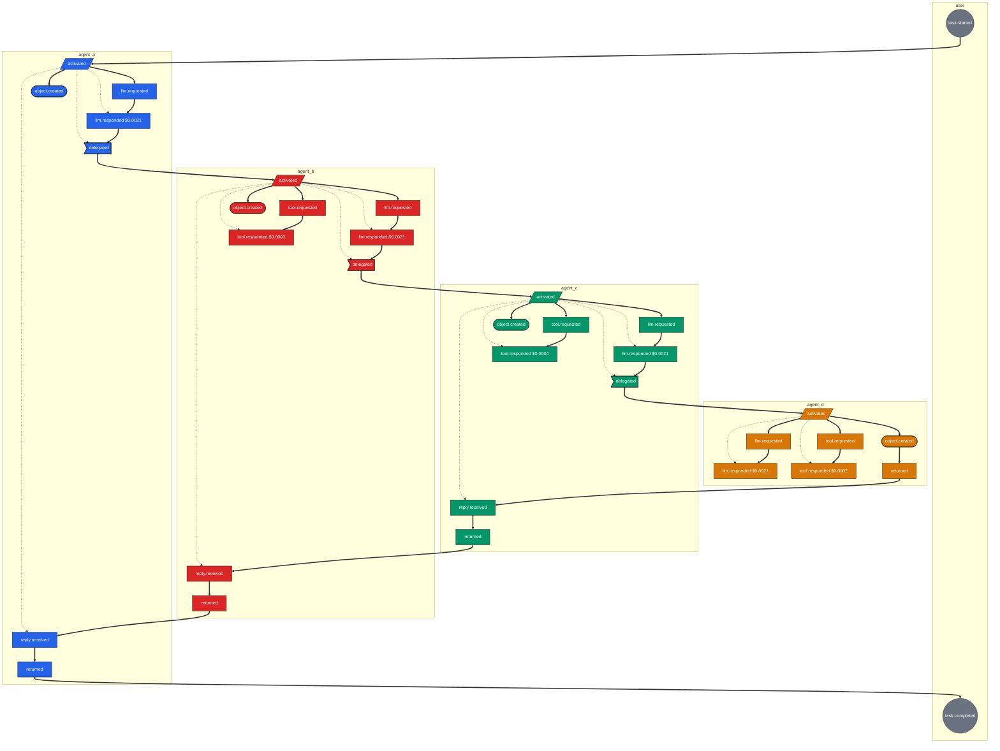

```mermaid
flowchart TD
  subgraph g_11aa035cfdac950d9bd4db06502b0594["user"]
    n0((task.started))
    n33((task.completed))
  end
  subgraph g_e588f28ae0d0f0c407bfb817ac2f1e2d["agent_a"]
    n1[/activated/]
    n2[llm.requested]
    n3[llm.responded $0.0021]
    n4([object.created])
    n5>delegated]
    n31[reply.received]
    n32[returned]
  end
  subgraph g_3fecdf53ebbc16ec23335cf192a14fb7["agent_b"]
    n6[/activated/]
    n7[llm.requested]
    n8[llm.responded $0.0021]
    n9[tool.requested]
    n10[tool.responded $0.0003]
    n11([object.created])
    n12>delegated]
    n29[reply.received]
    n30[returned]
  end
  subgraph g_c7520b8cb7a438a233094f767d8b5414["agent_c"]
    n13[/activated/]
    n14[llm.requested]
    n15[llm.responded $0.0021]
    n16[tool.requested]
    n17[tool.responded $0.0004]
    n18([object.created])
    n19>delegated]
    n27[reply.received]
    n28[returned]
  end
  subgraph g_136735d70725098af049298e4fbb1d44["agent_d"]
    n20[/activated/]
    n21[llm.requested]
    n22[llm.responded $0.0021]
    n23[tool.requested]
    n24[tool.responded $0.0002]
    n25([object.created])
    n26[returned]
  end
  n0 ==> n1
  n1 ==> n2
  n1 ==> n4
  n1 -.-> n3
  n1 -.-> n5
  n1 -.-> n31
  n2 ==> n3
  n3 ==> n5
  n5 ==> n6
  n6 ==> n7
  n6 ==> n9
  n6 ==> n11
  n6 -.-> n8
  n6 -.-> n10
  n6 -.-> n12
  n6 -.-> n29
  n7 ==> n8
  n8 ==> n12
  n9 ==> n10
  n12 ==> n13
  n13 ==> n14
  n13 ==> n16
  n13 ==> n18
  n13 -.-> n15
  n13 -.-> n17
  n13 -.-> n19
  n13 -.-> n27
  n14 ==> n15
  n15 ==> n19
  n16 ==> n17
  n19 ==> n20
  n20 ==> n21
  n20 ==> n23
  n20 ==> n25
  n20 -.-> n22
  n20 -.-> n24
  n21 ==> n22
  n23 ==> n24
  n25 ==> n26
  n26 ==> n27
  n27 ==> n28
  n28 ==> n29
  n29 ==> n30
  n30 ==> n31
  n31 ==> n32
  n32 ==> n33
  classDef g_agent_a fill:#2563eb,color:#fff,stroke:#111,stroke-width:1px
  classDef g_agent_b fill:#dc2626,color:#fff,stroke:#111,stroke-width:1px
  classDef g_agent_c fill:#059669,color:#fff,stroke:#111,stroke-width:1px
  classDef g_agent_d fill:#d97706,color:#fff,stroke:#111,stroke-width:1px
  classDef g_user fill:#6b7280,color:#fff,stroke:#111,stroke-width:1px
  class n1,n2,n3,n4,n5,n31,n32 g_agent_a
  class n6,n7,n8,n9,n10,n11,n12,n29,n30 g_agent_b
  class n13,n14,n15,n16,n17,n18,n19,n27,n28 g_agent_c
  class n20,n21,n22,n23,n24,n25,n26 g_agent_d
  class n0,n33 g_user
```
